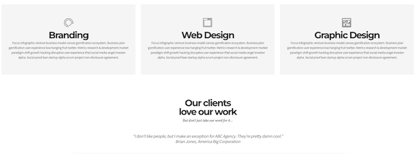
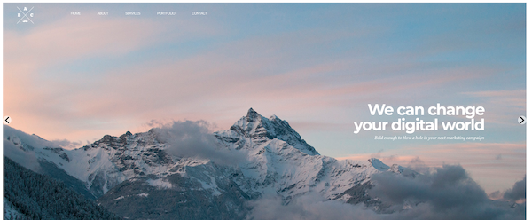

# Project Name

> Clone Portfolio website for practice
> Original website [_here_](http://creative-agency-template-20151.webflow.io).
> Live demo [_here_](https://www.example.com). <!-- If you have the project hosted somewhere, include the link here. -->

## Table of Contents

- [General Info](#general-information)
- [Technologies Used](#technologies-used)
- [Features](#features)
- [Screenshots](#screenshots)
- [Setup](#setup)
- [Usage](#usage)
- [Project Status](#project-status)
- [Room for Improvement](#room-for-improvement)
- [Acknowledgements](#acknowledgements)
- [Contact](#contact)
<!-- * [License](#license) -->

## General Information

- Clone a portfolio website in ReactJs for practice.
- This project was bootstrapped with Create React App.

<!-- You don't have to answer all the questions - just the ones relevant to your project. -->

## Technologies Used

- ReactJs - version 18.2.0
- react-bootstrap - version 2.4.0

## Features

List the ready features here:

- Awesome feature 1
- Awesome feature 2
- Awesome feature 3

## Screenshots

<!-- If you have screenshots you'd like to share, include them here. -->

## Setup

What are the project requirements/dependencies? Where are they listed? A requirements.txt or a Pipfile.lock file perhaps? Where is it located?

Proceed to describe how to install / setup one's local environment / get started with the project.

## Usage

How does one go about using it?
Provide various use cases and code examples here.

`write-your-code-here`

## Project Status

Project is: _complete_

## Room for Improvement

Include areas you believe need improvement / could be improved. Also add TODOs for future development.

Room for improvement:

- Improvement to be done 1
- Improvement to be done 2

To do:

- Feature to be added 1
- Feature to be added 2

## Acknowledgements

Give credit here.

- This project was based on [this site](http://creative-agency-template-20151.webflow.io).

## Contact

Created by [@crnndavid](https://github.com/crnndavid) - feel free to contact me!

<!-- Optional -->
<!-- ## License -->
<!-- This project is open source and available under the [... License](). -->

<!-- You don't have to include all sections - just the one's relevant to your project -->
